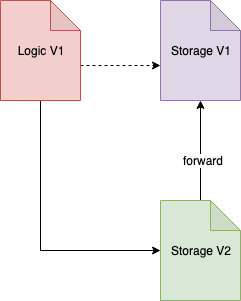

# Keeping Data and Logic Separately

Keeping the data and logic separately is the most intuitive way to handle upgrades, In most cases, we want to keep the data of the contract while adding newer features or fix bugs, or perhaps updating solidity version of the contract. hey

As shown in figure 1, The storage contract is responsible for storing all the data permanently within the contract. The contract A has a reference to the address of the storage contract and makes a call to Storage contract every time it needs to read/write a value. The gas cost is slightly more since it has to call the storage contract every time. For this to work, the Storage contract has to provide functions to mutate the state. 

For example, if the storage is of an ERC20 contract which stores the balances of all users, then functions to mutate it has to be provided.

The reason this pattern works is because it uses the Owner pattern, the Logic contract is made an Owner of the storage contract which allows it mutate the state and during the upgrade, the owner is changed to the new Logic contract, hence anyone calling the old contract will not be able to access storage at all.


Note that the Storage contract can never be upgraded, hence everything which needs to be stored has to be thought of before hand, however; there are ways to extend the storage contract.


As mentioned above, the assumption here is that Storage contract will never need to be upgraded, however it can be extended by adding another contract which extends it but references the old contract only to retrieve values, but all state updates are performed within the new Storage contract \(V2\).

Similarly, the Logic contract can be updated to only reference the Storage V2 and the owner of storage V1 can now be Storage V2 or `address(0)` based on the implementation.

